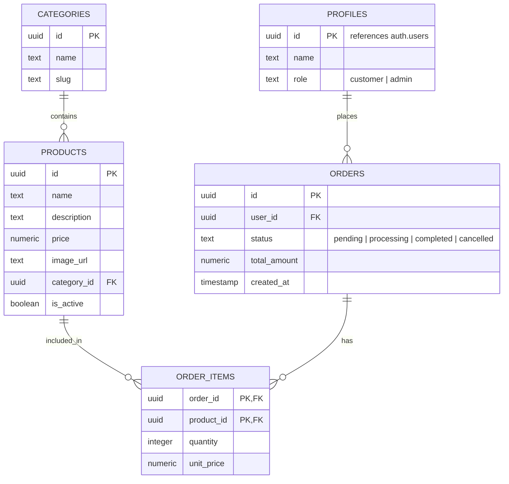

# Mini Shop Challenge: Requirements & Technical Analysis

This document provides a comprehensive analysis and mapping of the **Mini Shop** full-stack developer challenge based on the specifications in [Mini_Shop_Task.pdf](file:///home/a-fahmy/Documents/Task/Mini_Shop_Task.pdf).

---

## 1. Project Overview

The goal is to build a unified system composed of three main parts:
1. **Mobile App**: A React Native (Expo) customer-facing application.
2. **Backend API**: A Fastify Node.js server handling data validation, business logic, and database operations.
3. **Admin Dashboard**: A React (Vite) web panel for administrators to manage products and orders.

All three components connect to a single **Supabase** instance (PostgreSQL, Supabase Auth, and Supabase Storage).

---

## 2. Technology Stack

| Layer | Technologies / Libraries | Key Focus Areas |
| :--- | :--- | :--- |
| **Mobile App** | Expo SDK (latest stable), React Native, TypeScript, Expo SecureStore | UX/UI polish, Cart management, JWT secure storage, loading skeletons |
| **Backend API** | Node.js, Fastify, TypeScript, Zod | Input validation, JWT auth, Role-Based Access Control (RBAC), consistent error formatting |
| **Database / Auth** | Supabase (PostgreSQL, Supabase Auth, Storage) | Schema structure, Row-Level Security (RLS), custom claims, product image storage |
| **Admin Dashboard** | React (Vite), TypeScript, Tailwind CSS | Sidebar layout, KPI dashboards, product forms with image uploads, status filters |

---

## 3. Database Schema (Supabase/PostgreSQL)

Below is the database structure required to support all modules:

### Table Specifications & Constraints:
* **`profiles`**: Must extend Supabase Auth. A trigger on `auth.users` is ideal to auto-populate profiles on user registration.
* **`categories`**: Standard lookup table.
* **`products`**: Soft-delete is required (`is_active` toggle).
* **`orders`**: Tracks order lifecycle status.
* **`order_items`**: Junction table for order details.

---

## 4. Backend API Route Specification

The Fastify backend must implement the following endpoints. All inputs must be validated using **Zod**, and errors must conform to `{ statusCode, error, message }`.

### Authentication Routes
* `POST /auth/register` — Registers name, email, and password.
* `POST /auth/login` — Logins user and returns JWT.
* `POST /auth/forgot-password` — Triggers Supabase password reset email.
* `GET /auth/me` — **[Protected]** Returns the current user's profile.

### Product Routes
* `GET /products` — Lists active products (supports text search & category filters).
* `GET /products/:id` — Details for a single product.
* `POST /products` — **[Admin Only]** Creates a new product.
* `PATCH /products/:id` — **[Admin Only]** Updates product fields.
* `DELETE /products/:id` — **[Admin Only]** Soft-deletes product (`is_active = false`).

### Order Routes
* `POST /orders` — **[Protected (Customer)]** Places a new order.
* `GET /orders/my` — **[Protected (Customer)]** Retrieves the authenticated user's order history.
* `GET /orders` — **[Admin Only]** Lists all orders (paginated).
* `PATCH /orders/:id/status` — **[Admin Only]** Updates the order status (e.g., pending -> processing).

---

## 5. Component Details

### A. Mobile Application (Expo / React Native)
* **Design & Feel**: A highly polished UI with consistent typography, colors, and spacing. Loading skeletons, pull-to-refresh, empty states, and error handling must exist on every screen.
* **Main Screens**:
  1. **Authentication**: Login, Registration, and Forgot Password flows.
  2. **Product Catalogue**: Home screen with a product grid, category filter tabs, and a search bar.
  3. **Cart & Checkout**: Quantity controls, line items, subtotals, and a mock checkout flow.
  4. **Order History**: History list with order statuses (badges) and drill-down details.
  5. **Profile**: User info and logout trigger.
* **Security**: Auto-logout on JWT expiry. Tokens saved securely in `Expo SecureStore`.

### B. Admin Web Dashboard (React + Vite + Tailwind CSS)
* **Layout**: Responsive sidebar navigation (optimized for desktop & tablet screens).
* **Key Features**:
  1. **Dashboard Home**: KPI highlights (Orders Today, Revenue, Active Products).
  2. **Product Catalog Management**: Structured table of products allowing creation, editing, active-toggling, and uploading of product photos to Supabase Storage.
  3. **Order Control**: Searchable/filterable table of orders, status update actions, and a detailed modal view of order items.

---

## 6. Deliverables & Evaluation Criteria

### Required Files & Codebase structure:
* **Three sub-projects**: `/mobile`, `/backend`, and `/dashboard`.
* **Configuration**: Complete `.env.example` configurations and README setup guides in each folder.
* **Seed Data**: Pre-seeded database with $\ge 10$ products across $\ge 3$ categories.
* **Demo Credentials**: 1 Customer account, 1 Administrator account.
* **Video walk-through**: A 4-5 minute English video demo of the complete user flow.

### Grading Weights:
* **Functionality**: 35%
* **Code Quality & Typing**: 30%
* **UI/UX Design**: 20%
* **Security & Auth**: 10%
* **Bonus (Realtime, Themes, Reanimated)**: +5%
